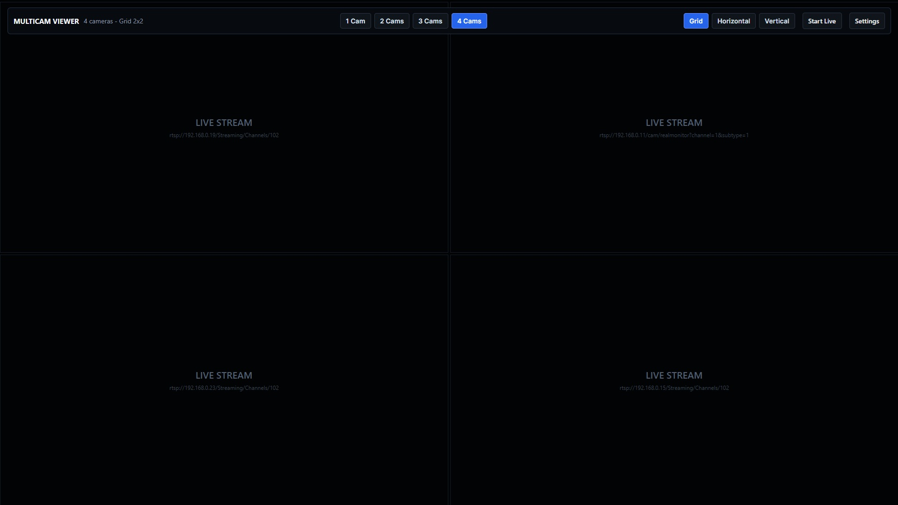
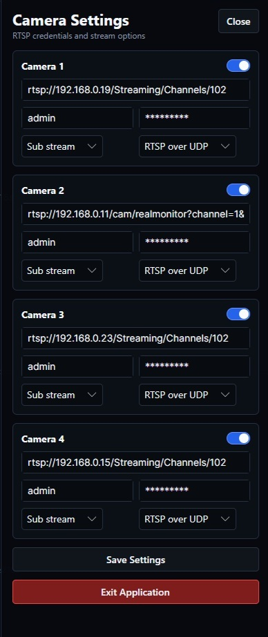

# MultiCamViewer

MultiCamViewer is a desktop application for simultaneously monitoring multiple IP cameras in a single window. It is designed for scenarios where it is important to quickly view all video streams in real time: object monitoring, area control, video intercom systems, local NVR/DVR setups, and RTSP source testing.

The application uses Avalonia for the UI and LibVLC for stream playback, providing a modern interface, full-screen mode, and flexible source configuration.

## Features

- Simultaneous viewing of up to 4 cameras in one interface
- Display modes: Grid, Horizontal, and Vertical
- Configuration of the number of active cameras and their arrangement
- Individual configuration for each camera: URL, login, password, stream type, and protocol
- Automatic detection and recovery of the connection when the stream is interrupted
- Notifications and statuses for each camera: connecting, error, no signal, disconnected
- Saving configuration between launches in a JSON file
- Full-screen mode for real-time monitoring
- Support for RTSP/network video streams with transport-level configuration
- Event logging to both the console and files

## Architecture

The project is built as a small desktop application with separation between the UI, settings, and stream logic.

### Main components

- `MultiCamViewer/Program.cs` — entry point, Avalonia and Serilog initialization
- `MultiCamViewer/App.axaml` and `App.axaml.cs` — root application
- `MultiCamViewer/MainWindow.axaml` and `MainWindow.axaml.cs` — main interface and core business logic
- `MultiCamViewer/AppSettings.cs` — global application settings
- `MultiCamViewer/CameraSettings.cs` — settings for an individual camera
- `MultiCamViewer/Logger.cs` — Serilog wrapper for logging

### How the application works

- The application loads configuration from the settings file on startup.
- For each active camera, a separate `MediaPlayer` is created via LibVLC.
- The URL is built based on the camera settings and selected display mode.
- Each stream is monitored for playback state, connection status, and automatic reconnect behavior.
- The user can switch the number of cameras, layout, and source parameters without restarting the application.

### Technology stack

- .NET 10
- Avalonia UI
- LibVLCSharp
- Serilog
- JSON for configuration storage

## Configuration

Application settings are stored in a JSON file in the user directory:

- Windows: `%APPDATA%\MultiCamViewer\settings.json`
- in local development, the file may be created near the executable or in the user profile

### Example settings structure

```json
{
  "CameraCount": 4,
  "Layout": "Grid",
  "Cameras": [
    {
      "Enabled": true,
      "Url": "rtsp://192.168.1.101/live",
      "Login": "admin",
      "Password": "password",
      "StreamIndex": 0,
      "TransportIndex": 0
    }
  ]
}
```

### Parameters

- `CameraCount` — number of active cameras, from 1 to 4
- `Layout` — layout type: `Grid`, `Horizontal`, `Vertical`
- `Cameras` — array of all camera settings
- `Enabled` — whether the camera is enabled
- `Url` — RTSP stream address
- `Login` / `Password` — credentials for access to the stream
- `StreamIndex` — stream access index (main, secondary, auto, etc.)
- `TransportIndex` — transport protocol used for connection

### How to configure the app for your cameras

1. Start the application.
2. Open the settings panel.
3. For each camera, specify the correct RTSP URL.
4. Check the login and password if the camera is protected.
5. Select the number of cameras and the desired layout type.
6. After saving, the settings are written automatically to JSON.

## Installation and Run

### Requirements

- .NET SDK 10+
- Windows/macOS/Linux
- Access to RTSP sources

### Build

```bash
dotnet build
```

### Run

```bash
dotnet run --project MultiCamViewer/MultiCamViewer.csproj
```

> For correct operation, a compatible .NET 10 SDK is required, since the project targets `net10.0`.

## Notes

- If the settings file is missing, the application creates default values automatically.
- If the connection is lost, the app attempts to reconnect automatically.
- Logs are written to the console and to a daily-rotating log file.
- For stable operation, use valid RTSP URLs and check network availability of the cameras.

## Screenshots

The [docs](docs) folder contains interface images for the application, which help explain the structure and operating modes of the program.

### Main view



### Settings panel


